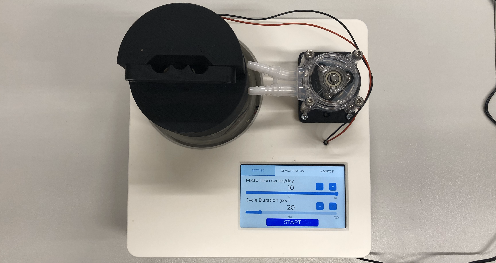
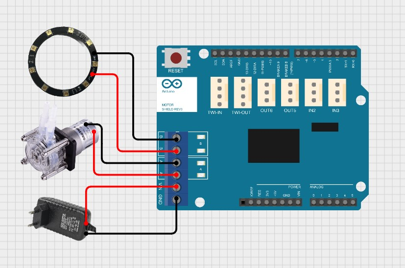
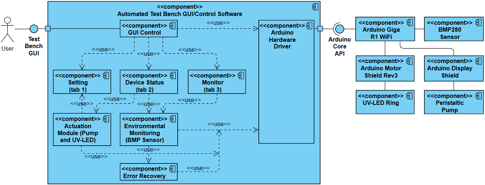
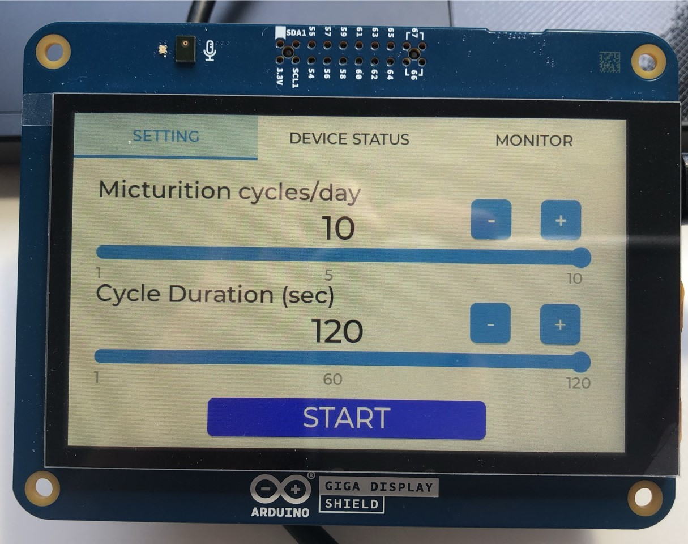
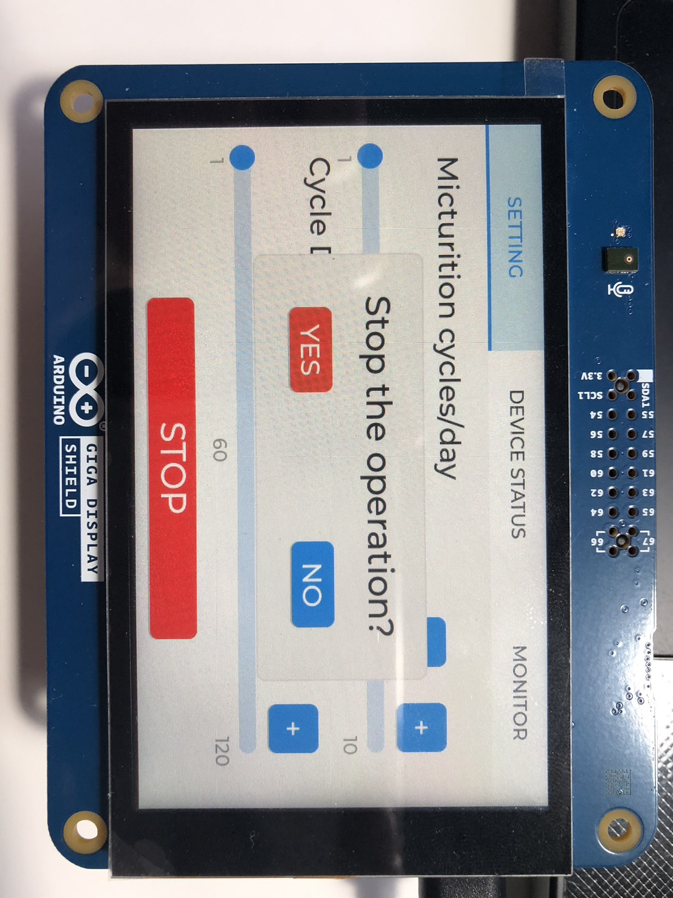
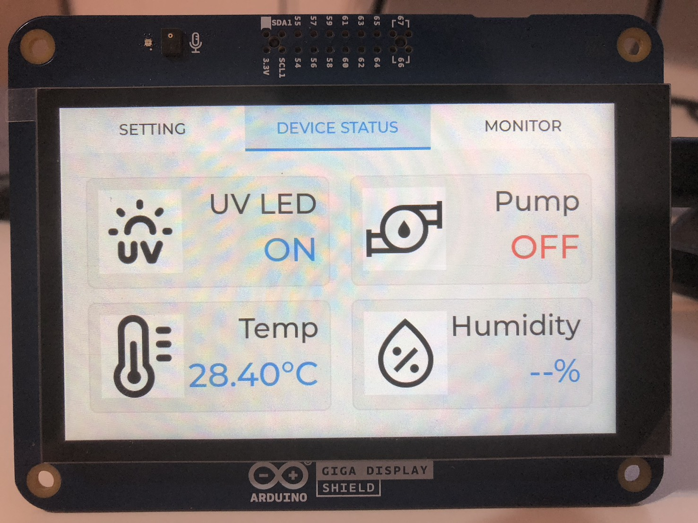
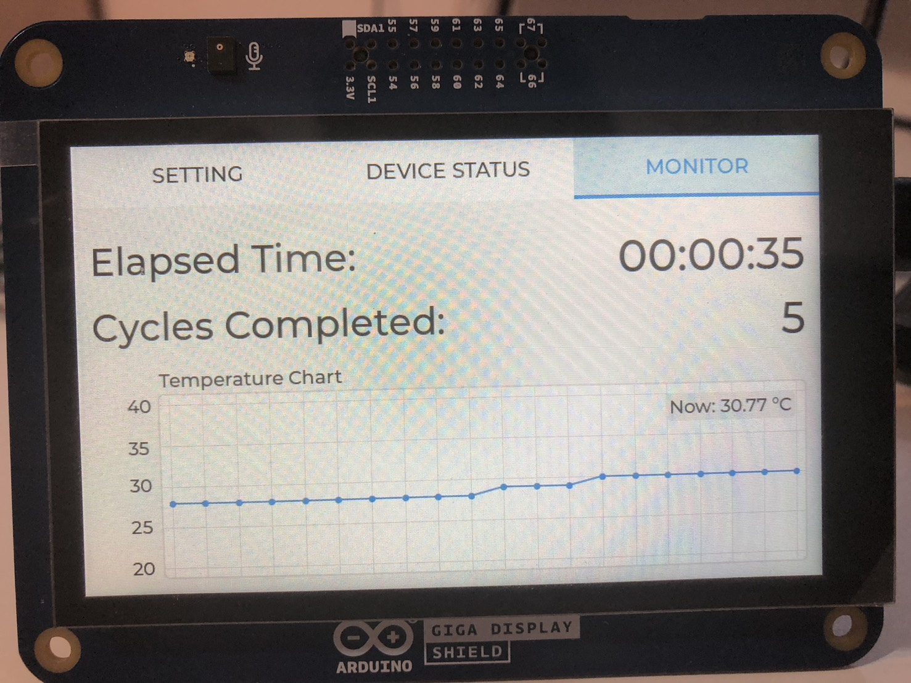

## Project Documentation

- **Full Report:** [View the complete project report](https://github.com/IEn-Lee/Endourological-Test-Bench-Embedded-Control/blob/main/User%20Interface%20and%20Control%20Software%20for%20an%20Automated%20Test%20Bench%20for%20the%20Analysis%20of%20Biofilm%20Formation_Project_Thesis.pdf)
- **Illustrated Overview:** [Explore the project with figures and explanations](https://github.com/IEn-Lee/Endourological-Test-Bench-Embedded-Control/blob/main/Project%20Thesis%20Portfolio.pdf)
- **Text Summary:** [Read the text-based project summary](https://github.com/IEn-Lee/Endourological-Test-Bench-Embedded-Control/blob/main/Project_Thesis_Selected_Extract.pdf)  
*(If GitHub fails to display the PDF preview, please download the file and open it locally)*

---

## User Interface and Control Software for an Automated Test Bench for the Analysis of Biofilm Formation

### Project Background and Objective

This 10 ECTS project at the Institute for Factory Automation and Production Systems (FAPS), FAU Erlangen-Nürnberg, focused on the **development of embedded control software and a touchscreen user interface for an automated biomedical test bench**.

The project supports research on a mechanical intraurethral artificial urinary sphincter. To investigate how prolonged exposure to urine and repeated fluid-flow cycles affect the implant, researchers need a test platform that can reproduce a defined experimental schedule and provide clear information about ongoing operation.

My work connected **experimental requirements, embedded programming, hardware integration, and user-interface design**. The resulting platform allows operators to configure simulated micturition cycles, control the pump and UV-LED module, and monitor temperature and test progress through a single touchscreen interface.

  

<em>Figure 1. Assembled test platform showing the fluid container, peristaltic pump, and touchscreen interface.</em>

### My Contribution

The main contributions of this project were:

- Developing an **LVGL-based touchscreen interface** for parameter configuration, device-status display, and test-progress monitoring.
- Implementing **embedded C/C++ control software** to coordinate pump operation, UV-LED activation, temperature acquisition, and cycle scheduling.
- Integrating the **Arduino GIGA R1 WiFi, GIGA Display Shield, Motor Shield Rev3, and BMP280 sensor** into a unified control system.
- Implementing **non-blocking cycle timing**, event-driven user interaction, and automatic I²C bus recovery to support extended operation.
- Evaluating the implemented functionality and reviewing interface usability using **Nielsen's ten usability heuristics**.

The project focused on the test platform and its UI/control software. It provides experimental infrastructure for biofilm investigations; it does not directly measure biofilm growth or establish the clinical performance of the implant.

### Hardware Integration and Actuation

The Arduino GIGA R1 WiFi coordinates the touchscreen, actuators, and temperature sensor. The Motor Shield Rev3 provides the actuator interface for the peristaltic pump and UV-LED ring.

| Component | Role in the platform |
| --- | --- |
| Arduino GIGA R1 WiFi | Executes the control program, cycle scheduling, sensor acquisition, and GUI logic. |
| Arduino GIGA Display Shield | Provides touchscreen input and displays the LVGL interface. |
| Arduino Motor Shield Rev3 | Interfaces the controller with the pump and UV-LED module. |
| Peristaltic pump | Generates the fluid-flow periods used to simulate micturition cycles. |
| UV-LED ring | Provides the controllable UV light source intended to suppress microbial growth in the test-fluid reservoir. |
| BMP280 sensor | Supplies environmental temperature readings through I²C communication. |

  

<em>Figure 2. Actuation-module wiring, corresponding to Figure 10 in the project report. The pump and UV-LED ring use separate Motor Shield output channels.</em>

The firmware controls the pump through PWM and digital outputs. Each pumping period lasts for the duration selected by the operator, after which the pump stops until the next scheduled cycle. The UV-LED remains active during the running test sequence. When the operator confirms termination, both actuators are switched off.

### Software Architecture and Automated Control

The software separates **user interaction, actuation, environmental monitoring, and error recovery** into functional modules. This structure makes the relationship between interface commands and hardware actions explicit and supports maintenance and future expansion.

  

<em>Figure 3. Software component architecture, corresponding to Figure 12 in the project report. GUI Control coordinates the interface tabs and the underlying control and monitoring modules.</em>

The main program uses **millis()-based non-blocking scheduling** for normal cycle operation. This allows pump timing, temperature acquisition, display updates, and touch-event handling to progress without holding the program in a long waiting period between cycles.

The configured number of daily cycles determines the nominal interval between cycle starts: **86,400 seconds divided by the number of cycles per day**. The selected cycle duration determines how long the pump operates during each cycle. After a cycle finishes, the completed-cycle counter is updated.

To improve resilience during extended tests, the temperature module detects invalid readings or communication failures and attempts **I²C bus recovery and sensor reinitialization**. The routine generates clock pulses to release the bus and then restarts communication with the BMP280.

### Touchscreen Interface

The interface follows a three-tab structure: **Setting**, **Device Status**, and **Monitor**. Each tab supports a distinct part of the laboratory workflow, from configuring a test to checking actuator states and observing progress.

#### Setting Tab and Accidental-Touch Protection

The Setting tab provides two adjustable parameters:

- **Micturition cycles per day:** 1–10 in the illustrated implementation.
- **Cycle duration:** 1–120 seconds in the illustrated implementation.

Sliders allow quick adjustment, while increment and decrement buttons support precise changes. Numeric labels show the selected values directly. The main button changes from **START** to **STOP** when the test is running.

To reduce accidental interruptions, pressing STOP opens a confirmation dialog. Selecting **YES** terminates the test; selecting **NO** cancels the stop request and allows operation to continue.

<table>
  <tr>
    <td align="center" width="50%"></td>
    <td align="center" width="50%"></td>
  </tr>
  <tr>
    <td align="center"><em>(a) Parameter configuration</em></td>
    <td align="center"><em>(b) Stop-confirmation dialog</em></td>
  </tr>
</table>

<em>Figure 4. Setting tab and accidental-touch protection, following the paired presentation of Figure 13 in the project report.</em>

#### Device Status Tab

The Device Status tab gives operators a compact view of the pump state, UV-LED state, and current temperature. Icons identify the components, while text and color indicate whether each actuator is ON or OFF. Temperature readings are refreshed once per second in the implementation described in the report.

The **humidity field is a placeholder for a future sensor extension** and is displayed as `--%` in the illustrated interface. Humidity measurement was not implemented in this project.

  

<em>Figure 5. Device Status tab, corresponding to Figure 14 in the project report. The interface displays actuator states and temperature, with a reserved humidity field.</em>

#### Monitor Tab

The Monitor tab brings together the main indicators of test progress:

- **Elapsed time** since the test started.
- **Completed-cycle count** to track the progress of the automated sequence.
- **Temperature trend** displayed as a continuously updated line chart.
- **Latest temperature value** displayed alongside the chart.

This view allows the operator to inspect test progress and environmental changes without switching between separate instruments or inspecting the firmware.

  

<em>Figure 6. Monitor tab, corresponding to Figure 15 in the project report. The image illustrates the interface; the displayed values are not a record of the full endurance test.</em>

### Evaluation and Reported Results

Evaluation covered the implemented control functions and an **expert-based interface review using Nielsen's ten usability heuristics**. The review examined status visibility, consistency, parameter adjustment, workflow clarity, and prevention of accidental interruption. It did not involve an external-participant usability study.

The project report records **nearly two months of continuous operation and more than 400 automated test cycles without critical software errors or control failures** at the time of writing. This provides evidence of sustained operation under the reported test conditions.

The work demonstrates the integration of embedded programming, actuator control, sensor communication, interface design, and functional evaluation into an operational biomedical research platform.

### Current Scope and Future Extensions

The implemented platform uses scheduled, unidirectional pump operation and environmental temperature monitoring. It does not yet include pressure-regulated or closed-loop flow control, direct biofilm sensing, or implemented humidity measurement.

Potential extensions include flow and pressure sensing, additional environmental measurements, persistent data logging, remote supervision, and more detailed on-screen fault messages. These additions would expand the platform's experimental capabilities while building on its modular software structure.

## Arduino Cloud Online IDE Version (Highly recommended)
This project provides an environment and configuration tailored for the Arduino Cloud Online IDE.  
This release is based on version 2.3.4, with layout optimizations specifically for the Arduino Cloud Online IDE and several known issues fixed.  
(The list of fixes is documented [Here](https://github.com/IEn-Lee/FAPs_GUI-Design/tree/055a39892351faafc0a5967386c1bd63970b6a5c/Arduino%20Cloud%20Online%20IDE%20Revision%20Log))

🔗 **Arduino Cloud Public Link**  
https://app.arduino.cc/sketches/b8669c34-cbed-4f0a-9a7e-f5ab9a029865?view-mode=preview  
Note: Please use LVGL version 8.3.10.
